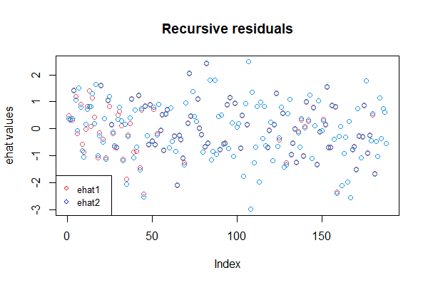

# PredictiveAccuracyComparisonsNested
This repository contains the codes for using the predictive accuracy comparison tests developed in Pitarakis, J. (2023). "A novel approach to predictive accuracy testing in nested environments", Econometric Theory, 2023. DOI: https://doi.org/10.1017/S0266466623000154.

Funding from the ESRC through grant ES/W000989/1 is gratefully acknowledged.

# Background
In ET2023, Pitarakis proposed a series of test statistics for testing that two nested models have an equal out of sample predictive accuracy (null hypothesis). 
Informally: consider two competing (nested) models given by Model 1 (smaller one) and Model 2 (larger one) and suppose that you wish to test the null that 
$MSE_1 = MSE_2$ vs $MSE_1 > MSE_2$. 
Once one obtains the out-of-sample forecast errors associated with each model (see below) one feeds them in the test statistic $S_0$ and $S_{Bar}$ which are shown to be asymptotically normally distributed. There is also an adjusted version of each of these test statistics discussed below.

The program builds forecasts in a recursive manner. Note also that for the paper mainly considers 1-step ahead prediction, while the codes available are adapted for h-steps ahead prediction: 

$y_{t+h} = β_0 + βx_t + u_{t+h}$, (1)

and suppose that there are n observations. 

Recursive forecasting (expanding window) involves choosing a sample location (say $k0 = [n*\pi_0]$ for some $\pi_0 ∈ (0, 1))$ to start the first estimation i.e., run OLS on (1) using $t = 1, . . . , k0$, obtain the corresponding LS estimate, say $\hat{β}(1: k0)$ and use it to forecast $y_{k0+h}$ as $\hat{y}${k0+h} $= \hat{\beta}$(1: k0) $x_{k0}$. Next, rerun the same regression using $t = 1, . . . , k0 + 1$, get the updated LS estimate of $\hat{\beta}$ and form the forecast $\hat{y}${k0+h+1} $= \hat{\beta}$(1: k0 + 1) $x_{k0+1}$. Repeat for all (feasible) $t$, i.e. the last forecast should be $\hat{y}${n}$|n−h$. Once these forecasts have been obatained one can get the corresponding forecast errors as $e_{t+1}|t = y_{t+1} − \hat{y}_{t+1}|t$. 

Note that in this example this should give you a total of ($n − k0 - h + 1$) forecast error observations. Suppose you do that across two competing models and obtain two sequences of one-step ahead forecast errors, say $\hat{e}_1$ and $\hat{e}_2$. These are the inputs subsequently used in the test statistics developed in paper.

# The test statistics S0 and SBar
Suppose you have obtained the sequence of forecast errors associated with the two models. These are then used as inputs to obtain the numerator of the first test statistics $S_0$ as stated in (ET 6). Note that this statistic requires 2 ad-hoc inputs from the user ($\lambda_1$ and $\lambda_2$). So the code should expect these as inputs as well in addition to $\hat{e}_1$ and $\hat{e}_2$. Then, the test statistic also requires a suitable normaliser generically referred to as $\sigma^2$ in (ET 8). 

For a version of the test statistic under conditional homskedasticity one could simply use the expression at the top of page (ET 9) and referred to as $\sigma^2$ hom. It is usually advisable to use the residuals from the larger model to form the $\eta$ (i.e. use $\hat{e}_2$ instead of $\hat{e}_1$). 

For the version of the test statistic that corrects for heteroskedasticity one needs to use a robust Newey-West type estimator as in Deng and Perron (2008) for instance. 

To sum-up: given $\hat{e}_1$, $\hat{e}_2$, $\lambda_1$, $\lambda_2$ the program should output the quantity $S_0$. Note that there should be two versions of this depending on which $\sigma$ one chooses to use in (ET 8). For each of these two versions (homoskedasticity, heteroskedasticity) there should also be two versions: one that uses the standard expression (of residual difference) in (ET 15) and one that is referred to as the adjusted version (of residual difference) that replaces $\hat{e}_2$ as defined in (ET 33). To sum up the program should output 4 versions of (ET 15). 

The second test statistic ($S_{Bar}$) is defined (ET 9) and the code should follow similar principles to above. 

**Note that the corresponding p-values will be returned along with the test statistics, with the null hypothesis being the two models having identical predictive power.**

# Code Example

**Please first download and install the package *pretest* from Github (via *pretest_0.2.tar.gz*). It is also available on CRAN now.**

Suppose we have a dataset *data* (see the *dummy_data_2.xlsx* file in data folder for example) that contains 3 variables, $y$, $x_1$ and $x_2$ of a length of 250. 

For illustration, we consider 1 step ahead prediction and set $\pi_0 = 0.25$ (user could change it manually within 0 and 1 deciding what fraction of sample should be used). In this case, this means *round(250 x 0.25)* numbers of recursive residuals would be computed. **Note here, R would round up .5 to the nearest EVEN number, while MATLAB would push it far away from 0. Take our case for example, R would round it to 62, while MATLAB would round it to 63.**

`library(pretest)` 
`ehat1 = recursive_hstep_fast(y,x1,pi0,1)` 
`ehat2 = recursive_hstep_fast(y,cbind(x1,x2),pi0,1)` 

This will give back two series of recursive errors with a length of $(250-62-1+1)=188$. 

Feeding these two series into our program would then calculate the test statistics accordingly.

`S0test = Nested_Stats_S0(ehat1, ehat2, lam10, lam20)` 
`Sbartest = Nested_Stats_Sbar(ehat1, ehat2, lam20, tau0)` 

**It is noted here, lam10 and lam20 correpond to the user-define fraction of recursive residuals used for the computation of test statistics. Tau0 is the fraction to determine the user-chosen range of lam10 over which the average is taken. Normally speaking, all of them should be something within 0 and 1 and lam10 should not equal to lam20.** 

If we set $lam10 = 1, lam20 = 0.5, tau0 = 0.8$, running the codes above and we should be able to obtain results as follows:

| Statistics name        | Test           | P-values  |
| ---------------------- |:--------------:| ---------:|
| $S_0$                  | 0.5111115      | 0.3046365 |
| $S_0^{adj}$            | 0.6801042      | 0.2482192 |
| $S_0^{NW}$             | 0.4640591      | 0.3213027 |
| $S_0^{NW,adj}$         | 0.6174944      | 0.2684543 |
| $S_{bar}$              | 0.4746596      | 0.3175148 |
| $S_{bar}^{adj}$        | 0.6587367      | 0.2550324 |
| $S_{bar}^{NW}$         | 0.4309629      | 0.3332477 |
| $S_{bar}^{NW,adj}$     | 0.598094       | 0.2748886 |

That is, based on our test, the two linear models are different in terms of predictive power. For the aim of comparison with existing methods, such as DM and CW, one could also run their test using the *dm_cw* functions likewise:

`dm_cw_test = dm_cw(ehat1, ehat2)` 

This would give us results as follows:

| Statistics name        | Test           | P-values  |
| ---------------------- |:--------------:| ---------:|
| $dm$                   | -1.535945      | 0.9377241 |
| $dm^{NW}$              | -1.888479      | 0.9705192 |
| $cw$                   | -0.7598933     | 0.7763408 |
| $cw^{NW}$              | -0.8178937     | 0.793291  |

